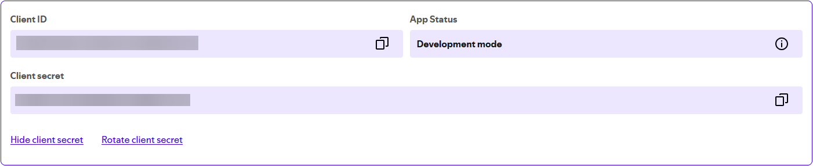
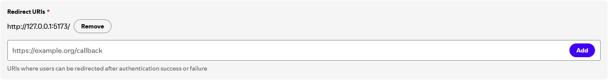
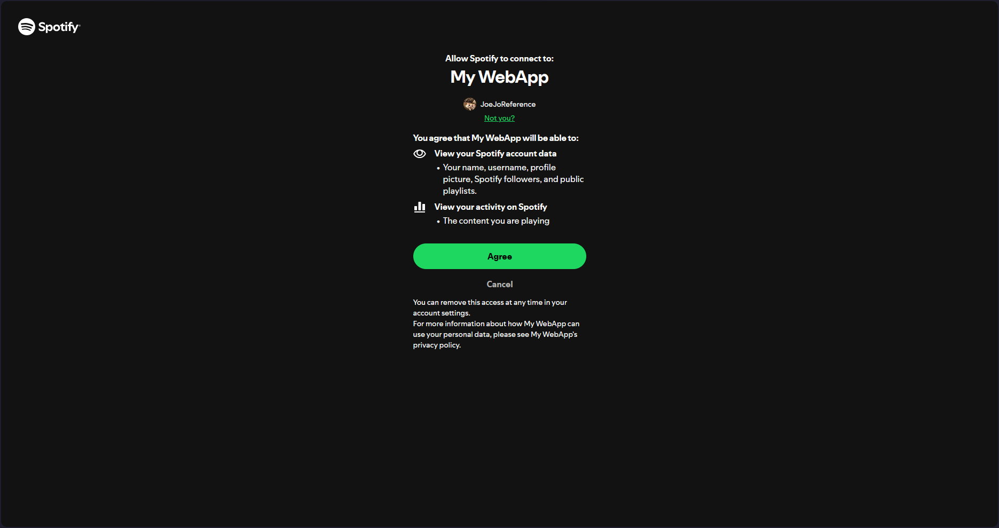

# API Shenanigans

This document describes the small API helper modules in `src/api/` used by the site:

- `unsplash.ts`: fetch Unsplash collections and photos
- `repos.ts`: fetch GitHub repositories for the project owner
- `spotify.ts`: exchange a Spotify refresh token and fetch the "now playing" item

> [!WARNING]
> The current usage of the API Keys are still considered bad practice.

---

## Conventions

- All helpers use `axios` and return parsed JSON / normalized objects.
- Environment variables are read via `import.meta.env.VITE_*` (Vite-style).
- Examples use top-level `await` for brevity (assume inside an async context in real code).

---

## Unsplash helper ([`unsplash.ts`](../api/unsplash.ts))

Fetch collections and photos from the Unsplash API for the gallery pages.

### Unsplash Envs

- `VITE_UNSPLASH_CLIENT_ID`: required for the requests in the current implementation.

### Unsplash Usage example

```ts
import { getCollections, getPhotos } from "./unsplash";

const cols = await getCollections();
const photos = await getPhotos({ collectionID: "12345" });
console.log(photos[0].urls.regular, photos[0].alt_description);
```

> [!NOTE]
> The helper currently appends `client_id` to the request URL.

---

## GitHub helper ([`github.ts`](../api/github.ts))

Fetch repositories for the `joejo-joestar` account (used to populate the Projects list).

### GitHub Envs

- `VITE_GITHUB_ACCESS_TOKEN`: reqiured for requests in current implementation

### GitHub Usage example

```ts
import { getRepos, repoBlacklist } from "./repos";

const repos = await getRepos();
const visible = repos.filter(
  (r: any) => !repoBlacklist.some((b) => b.id === r.id)
);
```

> [!NOTE]
> The helper sends `Authorization: token ${githubToken}` if `VITE_GITHUB_ACCESS_TOKEN` is provided.

---

## Spotify helper ([`spotify.ts`](../api/spotify.ts))

Obtain an access token via a stored refresh token, and fetch the currently-playing item for the authenticated Spotify account.

### Spotify Envs

- `VITE_SPOTIFY_CLIENT_ID`: The `Client ID` from the app created in [Spotify for Developers](https://developer.spotify.com/dashboard/create)
- `VITE_SPOTIFY_CLIENT_SECRET`: The `Client Secret` from the app created in [Spotify for Developers](https://developer.spotify.com/dashboard/create)
- `VITE_SPOTIFY_REFRESH_TOKEN`: The refresh token gotten after following the steps provided in the [Spotify Setup](#spotify-setup) section

### Endpoints

- Token endpoint: `https://accounts.spotify.com/api/token`
- Now playing: `https://api.spotify.com/v1/me/player/currently-playing`

### Behavior

- `getAccessToken(...)` posts `grant_type=refresh_token` to Spotify's token endpoint using HTTP Basic auth (`clientId:clientSecret` base64 encoded).
- `getNowPlaying()` calls `getAccessToken` with the env vars, then requests the now-playing endpoint with `Authorization: Bearer <access_token>`, normalizes the response, and returns a simplified object on success. If no track is playing or an error occurs it returns an error message string.

### Spotify Usage example

```ts
import { getNowPlaying } from "./spotify";

const now = await getNowPlaying();
if (typeof now === "string") {
  console.warn("Spotify error:", now);
} else {
  console.log(now.title, now.artist, now.albumImageUrl);
}
```

> [!NOTE]
> The helper performs client-side token exchange (using `clientId`/`clientSecret` from `import.meta.env`). For production, avoid exposing `clientSecret` in client bundles; prefer a server-side token exchange.
>
> The helper returns a string for error cases; callers should check `typeof result === 'string'`.

### Spotify Setup

[This article](https://medium.com/@alagappan.dev/create-a-now-playing-widget-using-the-spotify-web-api-in-react-a6cb564ed923) helped setting up the API calls and tokens for the now playing card. The steps to connect to your spotify account is very convoluted compared to the other endpoints.

- First, head over to [Spotify for Developers](https://developer.spotify.com/), create a new app, and fill in the details
- Take Note of the `Client ID` and the `Client Secret`
  
- Next, add the local host IP (`https://127.0.0.1:5173/`) (Spotify has blacklisted `http://localhost:5173/` from being used as a redirect URI in the [latest update](https://developer.spotify.com/documentation/web-api/concepts/redirect_uri))
  

Now, we generate a "Refresh Token", which will be used to generate fresh "Access Tokens" for the actual api call.

- Update the [Vite Config](../../vite.config.ts) to bind all interfaces

  ```ts
  server: {
      host: "0.0.0.0", // bind to all interfaces (IPv4 & IPv6)
      port: 5173,
  },
  ```

- Modify the below url with your `Client ID` from the [Spotify for Developers dashboard](https://developer.spotify.com/dashboard)

  ```plaintext
  https://accounts.spotify.com/en/authorize?client_id=<YOUR_CLIENT_ID>&response_type=code&redirect_uri=http%3A%2F%2F127.0.0.1:5173%2F&scope=user-read-currently-playing
  ```

- Agree to the authorization in this page
  

- Next, take note of the url of the redirected page, it should have a `?code=` parameter, like so,

  ```plaintext
  http://127.0.0.1:5173/?code=<SOME_REALLY_LONG_STRING>
  ```

- Now, generate a `base64` string of the form `<YOUR_CLIENT_ID>:<YOUR_CLIENT_SECRET>` (`e81...a07:0b0...57c`). The base64 scting can be generated [online here](https://www.base64encode.org/)
- Modify this `curl` command by adding the generated base64 string, and the `code` from the url earlier

  ```bash
  curl
  -H "Authorization: Basic <BASE64_CLIENT_ID_AND_SECRET_STRING>"
  -d grant_type=authorization_code
  -d code=<CODE_FROM_URL>
  -d redirect_uri=http://127.0.0.1:5173/ https://accounts.spotify.com/api/token
  ```

  the command should look something like this:

  ```bash
  curl -H "Authorization: Basic ZTg...N2M=" -d grant_type=authorization_code -d code=AQA...Eag -d redirect_uri=http://127.0.0.1:5173/ https://accounts.spotify.com/api/token
  ```

- The `curl` command should return the following response. From this, make note of the `refresh_token`

  ```json
  {
    "access_token": "BQD...fSw",
    "token_type": "Bearer",
    "expires_in": 3600,
    "refresh_token": "AQA...OGw",
    "scope": "user-read-currently-playing"
  }
  ```

- Now, store all the noted values of `Client ID`, `Client Secrt`, and this `refresh_token` in their respective environemt variables (see [Spotify Envs](#spotify-envs))

---

## Local .env example

Create a `.env` file (Vite reads `VITE_` prefixed vars):

```plaintext
VITE_UNSPLASH_CLIENT_ID=your_unsplash_client_id
VITE_GITHUB_ACCESS_TOKEN=ghp_yourgithubtoken
VITE_SPOTIFY_CLIENT_ID=your_spotify_client_id
VITE_SPOTIFY_CLIENT_SECRET=your_spotify_client_secret
VITE_SPOTIFY_REFRESH_TOKEN=your_saved_refresh_token
```

---
